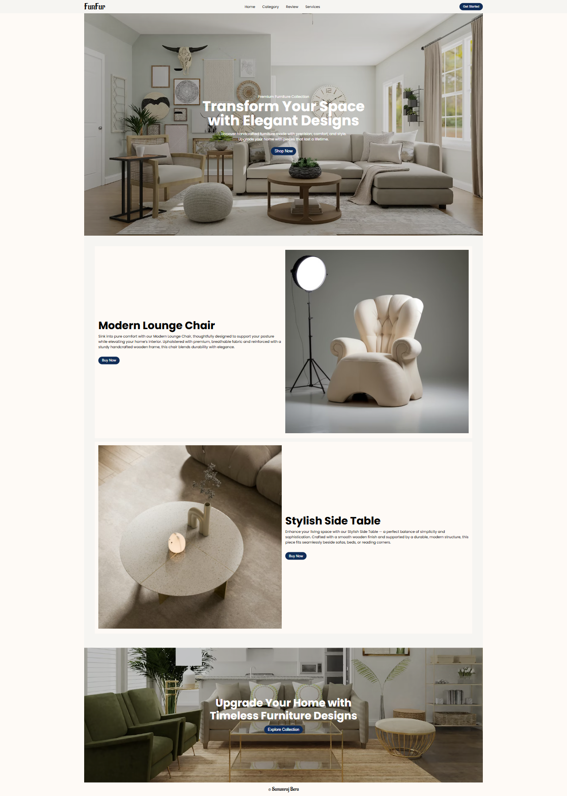

# Self Task:  Creating a webpage where I can combine JS with HTML and CSS
- First attempt: To create a navbar with sidebar (Status: Success). Codepen: [Link](https://codepen.io/Sumanraj-Bera/pen/ByjXwKw)
- Better attempt: This one is taking a step further and creating a navbar that works according to size with various modifications. Codepen: [Link](https://codepen.io/Sumanraj-Bera/pen/PwNoeGL)
  
## Task Completed
| 4k screen View         | Laptop View                 | Tablet view                | Mobile view                |
| ---------------------- | --------------------------- | -------------------------- | -------------------------- |
|  |  |  |  |

## Summary
I have tried to integrate HTML, CSS and JS together. I have tried to go against the regular dark & colorful theme and made a light theme. This was a bit challenging sa colors towards white look almost similar. But I have tried to make the UI as good as possible